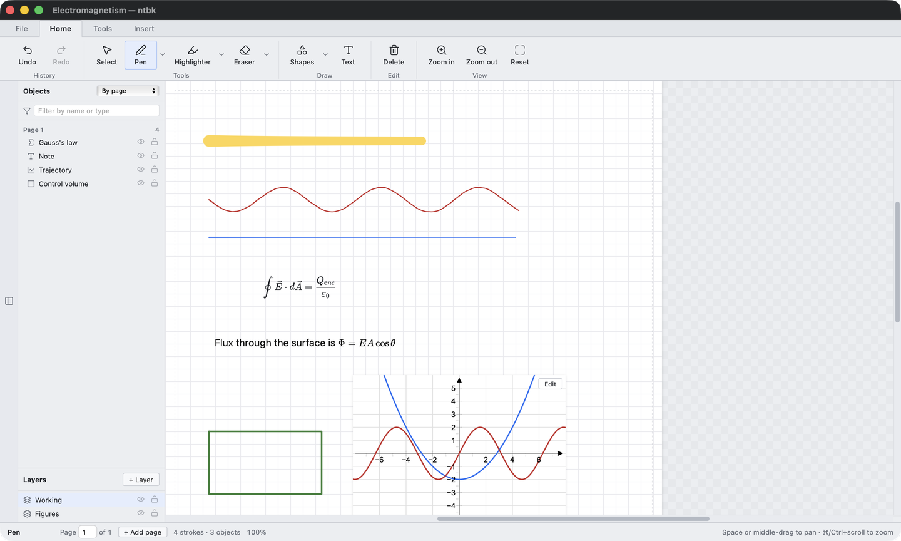

# ntbk

A STEM notebook for students. Handwriting, typeset maths, live plots and
runnable code on one infinite canvas — the way you actually take notes in a
physics or engineering lecture.

Everything runs on your machine. No account, no server, no network.



---

## Run it

Three commands. You need [Node ≥ 20.19](https://nodejs.org) and
[Python ≥ 3.10](https://python.org).

```bash
git clone https://github.com/Zehacksmith209/NTBK.git && cd NTBK
python3 -m venv venv && ./venv/bin/pip install -r requirements.txt
cd frontend && npm install && npm run build && cd ..
```

Then, every time:

```bash
./venv/bin/python ./ntbk/app.py
```

Stuck? [docs/INSTALL.md](docs/INSTALL.md) has the exact commands per platform,
and [docs/TROUBLESHOOTING.md](docs/TROUBLESHOOTING.md) has every error with its
fix.

---

## What it does

**Write.** Pressure-sensitive ink, a highlighter that multiplies so text stays
readable underneath, and an eraser that works whole-stroke or partial. Erasing
is stored as a subtractive mask, so a stroke keeps its original points and can
still be restyled or rescaled afterwards.

**Type maths.** LaTeX boxes rendered with KaTeX, and rich text where `$E=mc^2$`
typesets the moment you close the `$`. Both are part of the canvas — you can
draw over them like anything else on the page.

**Plot.** 2D functions, 3D surfaces and statistics charts through JSXGraph.
Type an equation containing `=` and you both implicit and explicit curves.

**Run code.** Code cells with a real terminal. The filename picks the language —
rename `a.py` to `a.cpp` and it compiles C++ instead. It uses the compilers and
interpreters already on your machine, so whatever you can run in a terminal you
can run here.

**Organise.** A SolidWorks-style object panel listing everything on the canvas,
with real layers, per-item visibility and locking, and an inspector showing
what each thing is, where it lives and how to edit it.

**Measure.** A 30 cm ruler with a protractor. Ink snaps to either edge, and the
ruler blocks the pen underneath it — like a real one.

**Export.** Every A4 page to PDF, or straight to a printer. Content off the page
is never included. A bit glitchy right now but will fix in later updates

---

## Documentation

| | |
|---|---|
| [INSTALL.md](docs/INSTALL.md) | Exact setup commands for macOS, Windows and Linux |
| [USAGE.md](docs/USAGE.md) | How to drive it: tools, layers, code cells, export |
| [TROUBLESHOOTING.md](docs/TROUBLESHOOTING.md) | Every known error and its fix |
| [FILE-FORMAT.md](docs/FILE-FORMAT.md) | What a `.ntbk` is, and where your files go |

---

## Status

Works today on **macOS**. **Linux** should work apart from toolchain discovery.
On **Windows** everything runs except the interactive terminal in code cells,
which needs a POSIX pty — see [TROUBLESHOOTING.md](docs/TROUBLESHOOTING.md).

This is a student project and a prototype. It is useful; it is not finished.

---

## History

The original PyQt6 prototype is preserved at the `v0.1.0-pyqt` tag and on the
`pyqt-prototype` branch. It still runs. The current version is a rewrite with an
HTML/CSS/JS frontend and Python reduced to a services layer.

## Licence

MIT — see [LICENSE](LICENSE).
