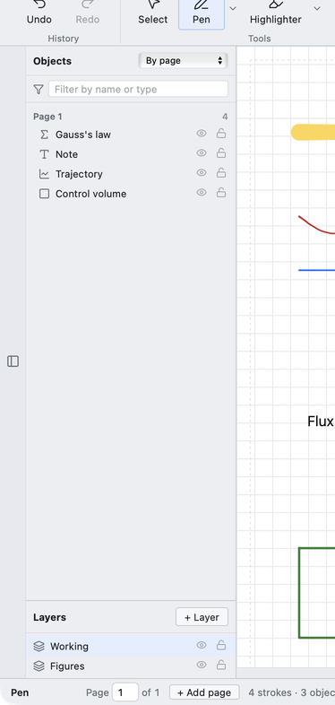

# Using ntbk



## The canvas

An infinite canvas with A4 pages laid out down it. Pan with **space + drag** or
middle-drag; zoom with **⌘/Ctrl + scroll**. **Reset** in the View group returns
you to the top.

The dashed lines inside each page mark what a printer cannot reach — 4 mm at the
sides and top, 10 mm at the bottom, where the paper feed grips. Write outside
them and it may not print. They are guides only and never print themselves.

Type a page number in the status bar to jump to it.

## Drawing

| Tool | Notes |
|---|---|
| **Pen** | Pressure-sensitive if your stylus reports it |
| **Highlighter** | Constant width, multiply blend, renders beneath the ink |
| **Eraser** | Whole-stroke or partial |
| **Shapes** | Line, arrow, rectangle, ellipse, triangle. Hold **Shift** to square up |

Every slider has a number beside it you can **type into** — drag for feel, type
for precision. Out-of-range values clamp; nonsense reverts.

Partial erasing is stored as a subtractive mask, not a destructive edit, so the
original points survive and the stroke stays restylable. Erase through the
middle of a stroke and the two halves become independent strokes you can then
erase whole.

## Selecting

**Select**, then drag a marquee or lasso. An item must be fully inside to be
picked up. Once selected: drag to move, corner handles to scale proportionally,
edge handles for one axis.

**Right-click** (or two-finger click) anything selected for rotate, flip,
colour, thickness, layer and delete.

## The object panel

The button on the left edge of the canvas opens it. It lists everything on the
canvas **except freehand ink** — objects, drawn shapes, and placed custom
shapes.

| Action | Result |
|---|---|
| **Click** a row | Selects it, and tells you which page it is on |
| **Double-click** | Goes to it and opens its properties or editor |
| **Right-click** | Inspector: Details, Editor and Layer tabs |
| **Hover** | Outlines it on the canvas |
| **Eye / padlock** | Hide or lock it |
| **Double-click the name** | Rename inline |

Sort by page, by type, or by creation order. The filter box matches name or type.

When something is pages away, clicking its row shows a badge at the edge of the
canvas pointing towards it with the page number.

## Layers

**Layer 1 sits on top.** Adding a layer puts it below.

Click a layer to make it active — everything you create then lands there. The
eye and padlock on a layer row apply to everything on it at once. Move a
selected item between layers from the **Layer** tab of the inspector, or from
the right-click menu.

Within one layer there is a fixed order: things you write *on* (formulas,
images, PDF pages, plots) sit under the ink, and things you work *in* (code
cells) sit above it. That is why your pen always lands on top of an imported
PDF page but never covers a code cell you are typing into.

## Maths and text

**Insert → LaTeX** gives a formula box. Double-click it to edit the source.

**Text** gives a rich-text box. The caret lands on the page grid so paragraphs
line up; drag it anywhere afterwards. Type `$E=mc^2$` and it typesets the moment
you close the `$`; `$$…$$` gives a display line. Font size, colour and bold are
in the inspector's Editor tab.

Click a text box once to select it, double-click to type in it.

## Plots

**Insert → Plot**, then pick 2D function, 3D surface or Statistics.

In the `y =` box, type an ordinary function like `x^2`, or an **equation** with
an `=` in it and you get an implicit curve:

```
9x^2 + 4y^2 = 36     an ellipse
x^2 + y^2 = 16       a circle
x^2/4 - y^2/4 = 1    both hyperbola branches
```

Edit plots from the inspector's Editor tab — expressions, x and y range, size —
or open the full editor for a live interactive board. 3D surfaces get Turn, Tilt
and Roll, in degrees.

## Code cells

**Insert → Code.** The **filename picks the language** — rename `a.py` to `a.cpp`
and it compiles C++.

It uses the toolchains already on your machine. If one is missing you get a
message saying so rather than a silent failure; type an explicit command in the
**Run** box to override.

Code cells never run on their own. Opening a `.ntbk` someone sent you runs
nothing until you press Run.

Each cell's source is mirrored to a real file beside your notebook in
`<name>.files/`, so you can open it in another editor.

## The ruler

**Tools → Ruler.** Drag the body to move it, the knob to turn it; hold **Shift**
while turning for 15° steps. The protractor at the centre reads 0° horizontal,
90° vertical.

Ink snaps to **either** long edge, and the ruler blocks the pen underneath it —
a stroke crossing it breaks and resumes on the other side, as it would on paper.
Set its length from the dropdown; 30 cm by default, and the centimetres are true
to the page.

The ruler is an instrument, not content: it is never saved and never printed.

## Custom shapes

Draw something, select it, then **Shapes → Save selection as a shape** and name
it. It appears in the Shapes menu, searchable, and drops onto the page at any
size.

A placed custom shape is **one object** — it appears as a single row in the
panel, and moves, hides, locks, renames and deletes as a unit even if it is made
of twenty strokes.

They are stored as individual `.ntbkshape` files, so you can drag them between
topic folders in Finder. See [FILE-FORMAT.md](FILE-FORMAT.md).

## Saving and exporting

**File → Save as** writes a `.ntbk`, or a PDF.

**File → PDF** has two modes:

- **Whole page** — everything on the A4 sheet
- **Printable area only** — blanks the margin strips, so the PDF matches what a
  printer will produce

**File → Print** hands the PDF to your system viewer, which owns the print
dialogue — so you get your real printer list and Save-as-PDF.

Either way, **content off the page is never exported.**

## Windows

**File → New window** opens a second notebook beside the first. Each window has
its own document, its own terminals and its own working directory, so two topics
cannot tread on each other.
